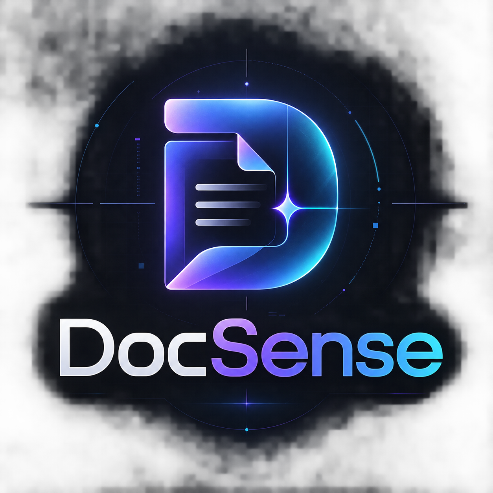
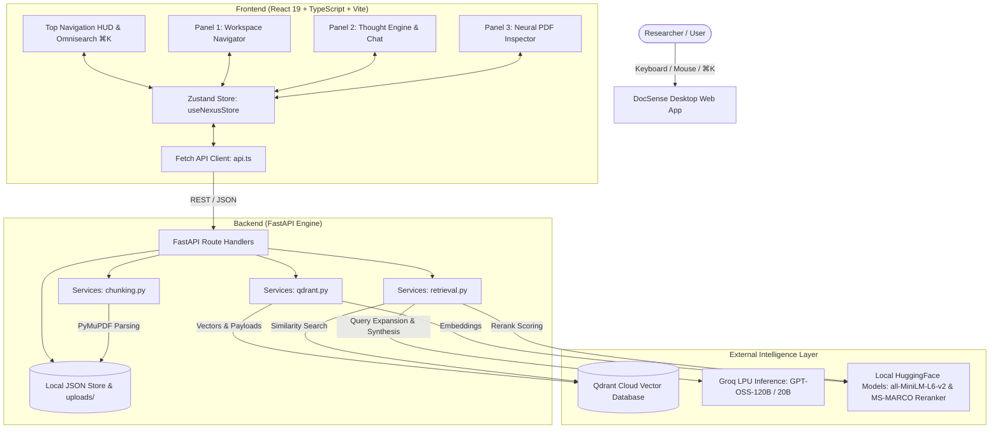

<div align="center">

  

  # ✦ DocSense (NEXUS)
  ### The Neural Knowledge OS & Pair-Researcher for Complex Documents

  <p align="center">
    <strong>A high-density analytical command deck for document intelligence, powered by PyMuPDF hierarchical parsing, Qdrant vector retrieval, cross-encoder neural reranking, Groq ultra-fast inference, and bi-directional PDF synchronization.</strong>
  </p>

  <p align="center">
    <a href="https://fastapi.tiangolo.com/"></a>
    <a href="https://react.dev/"></a>
    <a href="https://www.typescriptlang.org/"></a>
    <a href="https://qdrant.tech/"></a>
    <a href="https://groq.com/"></a>
    <a href="https://tailwindcss.com/"></a>
  </p>

  <p align="center">
    
    
  </p>

  <p align="center">
    <a href="#-executive-overview">Overview</a> •
    <a href="#-key-features--capabilities">Features</a> •
    <a href="#-system-architecture--rag-pipeline">RAG Pipeline</a> •
    <a href="#-the-3-panel-command-deck-ui">Command Deck UI</a> •
    <a href="#-api-reference">API Docs</a> •
    <a href="#-getting-started--installation">Installation</a> •
    <a href="#-environment-configuration">Configuration</a> •
    <a href="#-directory-structure">Structure</a>
  </p>

</div>

---

## ⚡ Executive Overview

> [!NOTE]
> ### 💡 Engineering Pedigree & Origins
> - 🛠️ **Backend Engine:** **Hand-written and architected by me from scratch.** Built with pure Python craftsmanship — featuring custom PyMuPDF font-aware hierarchical chunking, dynamic Qdrant collection lifecycle management, Groq multi-query expansion, and cross-encoder neural reranking.
> - ⚡ **Frontend Experience:** **100% Vibe-Coded.** Brought to life through rapid, fluid AI pair-programming to realize an editorial, telemetry-dense cyber-minimalist command deck without getting bogged down in boilerplate.

Standard document Q&A interfaces are clunky: they stuff answers into generic chat bubbles, hallucinate citations without page verification, lose context after two questions, and make you manually hunt through 50-page PDFs to verify facts.

**DocSense** transforms knowledge retrieval into a **tactile pair-programming experience for research**. Drawing aesthetic and structural inspiration from the high-density efficiency of **Cursor**, the minimalist polish of **Linear**, and the source-grounded rigor of **Perplexity**, DocSense bridges conversational AI with native document inspection.

```
┌────────────────────────────────────────────────────────────────────────────────────────┐
│                               DOCSENSE RUNTIME TOPOLOGY                                │
├──────────────────────────┬─────────────────────────────┬───────────────────────────────┤
│  WORKSPACE NAVIGATOR     │   THOUGHT & CHAT ENGINE     │     NEURAL PDF INSPECTOR      │
│  • Resizable V-Slabs     │   • RAG Pipeline Visualizer │     • Bi-directional Sync     │
│  • Dynamic Session List  │   • Query Expansion HUD     │     • Citation Page-Jump      │
│  • Checkbox Scope Matrix │   • Editorial Markdown      │     • "Ask About Selection"   │
│  • "Stargate" Dropzone   │   • Exact Source Badges     │     • Zoom / Fit / Page HUD   │
└──────────────────────────┴─────────────────────────────┴───────────────────────────────┘
```

---

## 💎 Key Features & Capabilities

### 🧠 1. Intelligent Hierarchical Document Ingestion
- **Font-Aware Layout Parsing:** Powered by **PyMuPDF (`fitz`)**, DocSense extracts font sizes, font weights, and span flags. It calculates adaptive font size statistics to hierarchically distinguish main titles, headings, subheadings, and body paragraphs.
- **Context-Preserving Overlapping Chunks:** Text is segmented into ~120-word semantic chunks with 30-word rolling overlaps, retaining full metadata (document name, hierarchical section header, and exact page number).
- **Automated Collection Provisioning:** Uploading a PDF dynamically spins up an isolated 384-dimensional cosine vector collection in **Qdrant Cloud** and indexes dense embeddings generated via `all-MiniLM-L6-v2`.

### 🔍 2. 6-Stage Deep RAG Pipeline
- **Multi-Query Expansion:** Before querying the vector index, DocSense leverages Groq (`openai/gpt-oss-120b`) and rolling conversational memory to expand the user query into **4 distinct search vectors** (resolving ambiguities like *"what about its architecture?"* or *"tell me more"* into rich semantic queries).
- **Multi-Collection Vector Retrieval:** Scans the active scoped document collections in parallel, pooling candidate text chunks.
- **Cross-Encoder Neural Reranking:** All retrieved candidates are scored against the original query using a dedicated cross-encoder (`cross-encoder/ms-marco-MiniLM-L6-v2`), filtering down to the **top-5 highest-relevance passages**.
- **Grounded Editorial Synthesis:** The LLM generates structured, publication-grade Markdown answers accompanied by strict JSON citation payloads (`source_text`, `file_name`, `page`).

### 🔗 3. Bi-Directional Neural Document Sync
- **Chat ➔ PDF Jump:** Clicking any interactive citation pill in the chat immediately navigates the right-hand PDF viewer to the exact page, applying a pulsing radiant cyan glow outline to confirm ground truth.
- **PDF ➔ Chat ("Ask About Selection"):** Highlighting any excerpt inside the PDF spawns a floating futuristic telemetry pill: `✦ Ask DocSense about this`. Clicking it immediately injects an explanation prompt for that excerpt into the prompt bar.

### 🎛️ 4. Futuristic Cyber-Minimalist UI
- **3-Panel Resizable Layout:** Powered by `react-resizable-panels`, allowing seamless drag adjustments between Sidebar, Chat Engine, and PDF Inspector, with layout presets (3-Panel Split, Focus Chat, Focus PDF, and Hide Sidebar).
- **Reasoning Trace Telemetry:** An animated glassmorphic HUD that visualizes each retrieval phase in real time (*Query Expansion ➔ Vector Retrieval ➔ Reranker ➔ Synthesis*), displaying step status and execution duration.
- **Global Omnisearch (`⌘K` / `Ctrl+K`):** Keyboard-first navigation to instantly switch sessions, scope/unscope documents, trigger file uploads, or open system telemetry.
- **Continuous Memory Summarization:** Maintains a background rolling summary (~200–300 words) of preceding exchanges so long-term context is never lost.

---

## 🔬 System Architecture & RAG Pipeline

> [!TIP]
> 📖 **Deep-Dive Backend Manual:** For an exhaustive mathematical and function-by-function walkthrough of the Python services, layout parser, Qdrant vectors, and Groq reranking pipelines, see **[`backend/ARCHITECTURE.md`](./backend/ARCHITECTURE.md)**.

### High-Level Architecture



### Retrieval & Synthesis Sequence Diagram

```mermaid
sequenceDiagram
    autonumber
    actor User as 👤 Researcher
    participant UI as 🖥️ Client UI (React 19)
    participant API as ⚡ FastAPI Engine (:8001)
    participant Groq as 🧠 Groq LPU (GPT-OSS-120B)
    participant Qdrant as 🔮 Qdrant Cloud (Cosine 384d)
    participant Rerank as 🎯 MS-MARCO Cross-Encoder

    rect rgb(18, 22, 34)
        Note over User,UI: CLIENT INTERACTION & TELEMETRY
        User->>UI: Selects "Nimbus_KB.pdf" & Types "When was it founded?"
        UI->>UI: Launch Reasoning Trace HUD (Stages 1–4)
        UI->>API: POST /ask?session_id=101 { query, include_pdf: ["Nimbus_KB.pdf"] }
    end

    activate API

    rect rgb(26, 22, 42)
        Note over API,Groq: STAGE 1: CONTEXTUAL QUERY EXPANSION
        API->>Groq: query_enhancer(query, chat_summary)
        Note over Groq: Resolves pronouns ("it", "its") from rolling conversation summary
        Groq-->>API: 4 Enhanced Search Queries (JSON)
        API->>API: Prepend original user query (Total: 5 search vectors)
    end

    rect rgb(18, 32, 36)
        Note over API,Qdrant: STAGE 2: PARALLEL VECTOR RETRIEVAL
        loop For each scoped PDF & each enhanced query
            API->>Qdrant: query_points(collection="Nimbus_KB.pdf", vector, limit=8)
            Qdrant-->>API: Top-8 candidate chunks with text payloads
        end
        API->>API: Deduplicate candidate chunks in-memory
    end

    rect rgb(34, 22, 30)
        Note over API,Rerank: STAGE 3: CROSS-ENCODER NEURAL RERANKING
        API->>Rerank: rank(query, candidate_passages, top_k=5)
        Note over Rerank: Full cross-attention eliminates false-positive vectors
        Rerank-->>API: Return Top-5 highest scoring passages
    end

    rect rgb(28, 26, 46)
        Note over API,Groq: STAGE 4: GROUNDED SYNTHESIS & STRICT CITATIONS
        API->>Groq: answer_generator(query, top_chunks, chat_summary)
        Note over Groq: Enforces strict JSON: Markdown answer + exact quotes & page numbers
        Groq-->>API: { answer: "Markdown...", citations: [{ source_text, file_name, page }] }
    end

    rect rgb(22, 32, 26)
        Note over API,Groq: STAGE 5: ROLLING MEMORY & SESSION PERSISTENCE
        API->>Groq: summary_generator(previous_summary, new_turn)
        Groq-->>API: Updated rolling 200–300 word conversation summary
        API->>API: Persist turn & summary into data/all_sessions.json
    end

    API-->>UI: HTTP 200 OK { answer, citations }
    deactivate API

    rect rgb(18, 22, 34)
        Note over UI,User: STAGE 6: TYPEWRITER STREAM & BI-DIRECTIONAL PDF SYNC
        UI->>UI: Typewriter reveal effect (word-by-word streaming)
        UI->>UI: Render interactive Citation Cards [Nimbus_KB.pdf · Page 1]
        User->>UI: Clicks Citation Badge
        UI->>UI: Panel 3 PDF viewer scrolls to Page 1 & flashes radiant cyan glow
    end
```



---

## 🖥️ The 3-Panel Command Deck UI

The UI is built with a bespoke **Cyber-Minimalist Design System** designed for zero-distraction focus during intense research:

```
┌───────────────────────────────────────────────────────────────────────────────────────────┐
│ ✦ DocSense ── Neural Knowledge OS v1.0   [ Search or ⌘K ]     AI ONLINE | QDRANT 8001 ⚙ │
├─────────────────┬───────────────────────────────────────┬─────────────────────────────────┤
│ WORKSPACE       │ ✦ NEURAL REASONING TRACE  [0.8s]      │ PDF INSPECTOR                  │
│                 │  ✓ Query Expansion (4 queries)        │ ◄ [ 1 ] / 14 ►  [-] [+] [Fit]  │
│ [+] NEW CHAT    │  ✓ Qdrant Retrieval (24 candidates)   ├─────────────────────────────────┤
│ ◉ Research v1   │  ✓ Cross-Encoder (Top 5 selected)     │                                │
│ ○ System Specs  │  ✓ Grounded Answer Synthesized        │  Nimbus Forge Technologies      │
│                 │                                       │  Pvt. Ltd.                      │
│ ─────────────── │ ## Executive Overview                 │                                 │
│ DOCUMENTS       │                                       │  Founded: 14 February 2021      │
│ [x] Nimbus.pdf  │ Nimbus Forge Technologies was founded │                                 │
│ [ ] Aster.pdf   │ on **14 February 2021** [1].          │  [ ✦ Ask DocSense about this]   │
│                 │                                       │                                 │
│ ┌─────────────┐ │ ┌───────────────────────────────────┐ │                                 │
│ │ ⇪ Drag PDF  │ │ │ ◉ Nimbus.pdf · Page 1             │ │                                 │
│ │ Stargate    │ │ │ "Nimbus Forge was founded..."     │ │                                 │
│ └─────────────┘ │ └───────────────────────────────────┘ │                                 │
├─────────────────┴───────────────────────────────────────┴─────────────────────────────────┤
│ ✦ Ask DocSense a research question... [Scoping 1 PDF]                        [Enter ↵]    │
└───────────────────────────────────────────────────────────────────────────────────────────┘
```

| Panel | Core Responsibilities |
| :--- | :--- |
| **Panel 1: Workspace Navigator** | <ul><li>**Chat Sessions Slab:** Create, switch, and delete sessions with real-time active indicators.</li><li>**Document Registry Slab:** Multi-select scoping checkboxes (`☑ include_pdf`) to isolate queries to specific files.</li><li>**Stargate Dropzone:** Animated drag-and-drop PDF uploader with real-time telemetry (*Parsing ➔ Embedding ➔ Indexing*).</li></ul> |
| **Panel 2: Thought & Chat Engine** | <ul><li>**Reasoning Trace HUD:** Live expandable accordion displaying the 4-step pipeline status.</li><li>**Editorial Markdown:** Code blocks with copy-to-clipboard, tables, custom cyan bullet points, and raw/rendered toggles.</li><li>**Typewriter Effect:** Smooth word-by-word streaming reveal with one-click skip.</li><li>**Interactive Citation Cards:** Shows snippet text, page number, and source file name.</li></ul> |
| **Panel 3: Neural PDF Inspector** | <ul><li>**Bi-Directional Citation Hook:** Instant page jumps synced with chat citation clicks.</li><li>**Text Selection HUD:** Floating action button to query the AI directly on any selected excerpt.</li><li>**Toolbar Controls:** Page switchers, zoom controls (50%–200%), fit-to-width mode, and direct PDF downloads.</li></ul> |

---

## 🎨 Design System & Color Tokens

DocSense implements a tailored dark-theme palette engineered for prolonged reading without eye strain:

| Token Name | Hex Code | Purpose & Application |
| :--- | :--- | :--- |
| **Deep Void** | `#08090D` | Base application canvas & root background |
| **Panel Surface** | `#101218` | Matte slate glass panel backgrounds |
| **Card / Elevated** | `#161922` | Hovered cards, message bubbles & modal surfaces |
| **Subtle Border** | `#252938` | Structural 1px division gridlines |
| **Active Border** | `#3B4256` | Focused elements, drag dividers & active hover rings |
| **Neural Violet** | `#8B5CF6` | Primary brand accent, glowing traces, AI identity |
| **Cyan Accent** | `#06B6D4` | Data badges, citation links & highlight flash markers |
| **Emerald Online** | `#10B981` | Real-time system telemetry and success indicators |
| **Radiant Text** | `#F5F7FA` | Primary editorial headings and high-contrast labels |
| **Muted Silver** | `#858B9A` | Secondary metadata, timestamps, and page numbers |

---

## 📡 API Reference

The backend runs on **FastAPI** (default port: `8001`) with automatic interactive documentation available at `http://localhost:8001/docs`.

### Core Endpoints

#### 1. System Health
```http
GET /
```
- **Response `200 OK`**:
```json
{
  "Message": "This is AI & RAG powered DOC Assistant"
}
```

---

#### 2. Document Upload & Ingestion
```http
POST /upload
Content-Type: multipart/form-data
```
- **Payload:** `file` (Binary PDF file)
- **Processing:** Sanitizes file name ➔ Extracts hierarchical layout text via PyMuPDF ➔ Chunks with overlap ➔ Creates 384-d vector collection in Qdrant ➔ Indexes points ➔ Records file in `data/all_pdfs.json`.
- **Response `200 OK`**:
```json
{
  "message": "The /UPLOAD endpoint successfully executed.",
  "file_path": "uploads/Nimbus_Knowledge_Base.pdf"
}
```

---

#### 3. Ask Question (Multi-Query RAG Engine)
```http
POST /ask?session_id=384
Content-Type: application/json
```
- **Request Body**:
```json
{
  "query": "When was Nimbus Forge Technologies founded?",
  "include_pdf": ["Nimbus_Knowledge_Base.pdf"]
}
```
- **Response `200 OK`**:
```json
{
  "answer": "## Company Foundation\n\n**Nimbus Forge Technologies Pvt. Ltd.** was officially founded on **14 February 2021**.",
  "citations": [
    {
      "source_text": "Nimbus Forge Technologies was founded on 14 February 2021.",
      "file_name": "Nimbus_Knowledge_Base.pdf",
      "page": 1
    }
  ]
}
```

---

#### 4. Session Management
| Method | Endpoint | Description |
| :--- | :--- | :--- |
| `POST` | `/session-create` | Creates a new chat session with a unique randomized ID. |
| `GET` | `/sessions` | Returns the list of all active sessions and titles. |
| `GET` | `/session/{session_id}` | Retrieves full conversation history and running chat summary for a session. |
| `DELETE` | `/session-delete/{session_id}` | Deletes a session and updates the database. |

---

#### 5. Document Management
| Method | Endpoint | Description |
| :--- | :--- | :--- |
| `GET` | `/pdfs` | Lists all indexed PDF document names available for scoping. |
| `GET` | `/pdf/{file_name}` | Streams the raw PDF file binary directly for browser embedding. |
| `DELETE` | `/delete/{file_name}` | Deletes the PDF from disk, purges its collection in Qdrant, and removes registry entries. |

---

## 📁 Directory Structure

```text
AI-Doc-Assistant/
├── DocSense_Logo.png                 # Official brand logo & README presentation asset
├── mindmap.md                        # Architectural blueprint & specification
├── .env                              # Backend API keys (Groq & Qdrant credentials)
│
├── backend/                          # FastAPI Service Engine
│   ├── main.py                       # Application entrypoint & REST route definitions
│   ├── schemas.py                    # Pydantic models (Query, Answer, Citation, Session)
│   ├── requirements.txt              # Python production dependencies
│   ├── services/
│   │   ├── __init__.py
│   │   ├── chunking.py               # PyMuPDF font-aware parser & overlapping chunker
│   │   ├── qdrant.py                 # Qdrant client, collections, & SentenceTransformer
│   │   └── retrieval.py              # Query expansion, vector query, reranking & synthesis
│   ├── data/
│   │   ├── all_pdfs.json             # Registry of uploaded documents
│   │   └── all_sessions.json         # Session history, chat turns & rolling summaries
│   ├── uploads/                      # Storage directory for uploaded PDF documents
│   ├── temp/                         # Test assets & sample evaluation PDFs
│   └── api_flow_tests/               # Comprehensive automated test suite
│       ├── run_all_tests.py          # 19-scenario end-to-end integration test harness
│       └── test_report.json          # Test execution audit log
│
└── frontend/                         # React 19 + TypeScript + Vite Desktop App
    ├── index.html                    # Application entrypoint (Fonts, Meta, Favicon)
    ├── vite.config.ts                # Vite build configuration
    ├── tailwind.config.js            # Custom cyber-minimalist design tokens & shadows
    ├── package.json                  # Dependencies (React 19, Lucide, Resizable Panels)
    ├── .env                          # Frontend environment (VITE_API_BASE_URL)
    └── src/
        ├── main.tsx                  # React DOM root mounting
        ├── App.tsx                   # Top-level composition & layout switcher
        ├── index.css                 # Global CSS rules, scrollbars & glassmorphism
        ├── store/
        │   └── useNexusStore.ts      # Global Zustand store (Sessions, Scope, Active PDF)
        ├── services/
        │   └── api.ts                # Typed fetch client for backend endpoints
        ├── hooks/
        │   └── useTypewriter.ts      # Silky smooth character/word streaming animation
        └── components/
            ├── layout/
            │   ├── TopNav.tsx         # Brand HUD, Telemetry, ⌘K trigger, layout presets
            │   └── ResizableLayout.tsx# 3-panel split view with draggable handles
            ├── sidebar/
            │   └── WorkspaceNav.tsx  # Sessions slab, scoped docs slab, Stargate dropzone
            ├── chat/
            │   ├── ChatContainer.tsx  # Message stream, sticky prompt bar, scope pill
            │   ├── MessageCard.tsx    # Editorial card with citation click handlers
            │   ├── MarkdownRenderer.tsx# Syntax-highlighted code blocks & formatted tables
            │   └── ReasoningTrace.tsx # 4-stage animated RAG pipeline HUD
            ├── pdf/
            │   └── PdfInspector.tsx   # PDF iframe engine, page navigation, text selection
            └── modals/
                ├── CommandPalette.tsx # ⌘K / Ctrl+K Omnisearch overlay modal
                └── SettingsModal.tsx  # Model selection & system diagnostic modal
```

---

## 🚀 Getting Started & Installation

### Prerequisites
- **Python:** `3.10` or higher
- **Node.js:** `18.x` or higher (`npm` or `pnpm`)
- **Groq API Key:** [Get a free API key at Groq Console](https://console.groq.com/)
- **Qdrant Vector DB:** A free cluster at [Qdrant Cloud](https://cloud.qdrant.io/) or a local Docker instance.

---

### Step 1: Clone Repository
```bash
git clone https://github.com/your-username/AI-Doc-Assistant.git
cd AI-Doc-Assistant
```

---

### Step 2: Backend Setup

1. **Create and activate a virtual environment:**
   ```bash
   # Windows (PowerShell)
   python -m venv venv
   .\venv\Scripts\Activate.ps1

   # Linux / macOS
   python3 -m venv venv
   source venv/bin/activate
   ```

2. **Install dependencies:**
   ```bash
   pip install -r backend/requirements.txt
   ```

3. **Configure Environment Variables:**
   Create a `.env` file in the project root (or inside `backend/`):
   ```env
   GROQ_API_KEY="your-groq-api-key"
   QDRANT_URL="https://your-cluster-id.qdrant.io"
   QDRANT_API_KEY="your-qdrant-api-key"
   ```

4. **Launch the FastAPI Server:**
   ```bash
   cd backend
   uvicorn main:app --reload --port 8001
   ```
   > The API will be live at `http://localhost:8001` (Docs at `http://localhost:8001/docs`).

---

### Step 3: Frontend Setup

1. **Open a new terminal and navigate to the frontend directory:**
   ```bash
   cd frontend
   npm install
   ```

2. **Configure Frontend Environment:**
   Ensure `frontend/.env` points to your backend instance:
   ```env
   VITE_API_BASE_URL=http://localhost:8001
   ```

3. **Start the Vite Development Server:**
   ```bash
   npm run dev
   ```
   > The UI will be available at `http://localhost:5173`.

---

## ⚙️ Environment Configuration

| Variable | Scope | Required | Description |
| :--- | :--- | :---: | :--- |
| `GROQ_API_KEY` | Backend | **Yes** | API key for Groq LPU inference (`openai/gpt-oss-120b`). |
| `QDRANT_URL` | Backend | **Yes** | URL of your Qdrant instance (e.g. `https://xyz.qdrant.io:6333`). |
| `QDRANT_API_KEY` | Backend | **Yes** | Access key for authenticated Qdrant Cloud clusters. |
| `VITE_API_BASE_URL` | Frontend | **Yes** | Root URL where the FastAPI backend is hosted (`http://localhost:8001`). |

---

## ⌨️ Keyboard Shortcuts & Productivity

| Shortcut | Context | Action |
| :---: | :--- | :--- |
| <kbd>⌘ K</kbd> or <kbd>Ctrl + K</kbd> | Global | Open the **Omnisearch Command Palette** |
| <kbd>Esc</kbd> | Global | Close open modals (Command Palette, Settings) |
| <kbd>Enter ↵</kbd> | Prompt Bar | Send prompt to DocSense Neural Engine |
| <kbd>Shift + Enter</kbd> | Prompt Bar | Insert a newline without submitting |
| <kbd>Click Card</kbd> | Assistant Message | Instantly skips the typewriter animation |
| <kbd>Click Citation</kbd> | Citation Badge | Smoothly jump PDF viewer to the exact cited page |
| <kbd>Highlight Text</kbd> | PDF Inspector | Trigger `✦ Ask DocSense about this` quick prompt |

---

## 🧪 Automated Testing & Quality Assurance

DocSense includes a comprehensive automated test harness located in [`backend/api_flow_tests/`](file:///c:/Users/tan90shq/Documents/001-Do_Not_Open/projects/AI-Doc-Assistant/backend/api_flow_tests).

To run the complete 19-scenario test suite:
```bash
# From the backend directory with venv activated
python api_flow_tests/run_all_tests.py
```

The test harness evaluates:
- **System Health & CORS Verification**
- **Session Lifecycle:** Creation, retrieval, history persistence, and deletion.
- **Upload Edge Cases:** Zero-byte PDFs, corrupt binary files, filename sanitization, duplicate uploads (`409 Conflict`), and payload size limits.
- **RAG Execution:** Scoped querying, Qdrant indexing, cross-encoder reranking, and citation structure validation.
- **Security Audit:** Path traversal protection on document deletion endpoints.

---

## 🗺️ Roadmap & Future Enhancements

- [x] Hierarchical PyMuPDF parsing with font size statistics
- [x] Qdrant dynamic collection management & dense vector embeddings
- [x] Multi-query expansion & cross-encoder neural reranking
- [x] Bi-directional PDF synchronization with citation jumping
- [x] Command Palette (`⌘K`) and layout presets
- [ ] **Hybrid Search:** Combine dense vectors with sparse BM25 keyword matching for exact numerical/serial retrieval.
- [ ] **OCR Ingestion Pipeline:** Integrate Tesseract / Surya OCR for scanned and image-heavy PDF documents.
- [ ] **Multi-Modal Reasoning:** Support chart, diagram, and table visual Q&A using vision-capable LLMs.
- [ ] **Export Reports:** One-click export of synthesized research briefs to Notion, Obsidian, and PDF formats.

---

## 🤝 Contributing

Contributions, bug reports, and feature requests are welcome!
1. Fork the Project
2. Create your Feature Branch (`git checkout -b feature/NeuralEnhancement`)
3. Commit your Changes (`git commit -m 'Add NeuralEnhancement'`)
4. Push to the Branch (`git push origin feature/NeuralEnhancement`)
5. Open a Pull Request

---

## 📄 License

This project is distributed under the **MIT License**. See `LICENSE` for more information.

---

<div align="center">
  <sub>Built with precision for researchers, engineers, and analysts who demand truth from their documents.</sub>
  <br />
  <strong>✦ DocSense — Transforming Documents into Intelligence ✦</strong>
</div>
