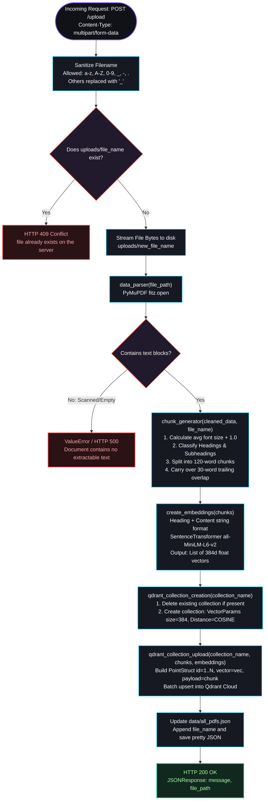

# ✦ DocSense Backend Architecture & Technical Specification
### Complete Systems Blueprint: End-to-End Flow, Endpoints & Function Showcase

---

<div align="center">

  

  ### Pure Python Craftsmanship • Hand-Written Core Architecture
  
  <p align="center">
    <strong>A high-density systems manual detailing the journey from raw PDF bytes to grounded citations: PyMuPDF font-aware layout parsing, Qdrant Cloud dynamic vector indexing, Groq LPU contextual query expansion, MS-MARCO neural reranking, and rolling conversational memory.</strong>
  </p>

  <p align="center">
    
    
    
    
    
    
  </p>

</div>

---

## 📑 Architectural Blueprint Index

1. [Big Structured Master Flow: From PDF Upload to Answer](#1-the-master-flow--from-pdf-upload-to-answer)
2. [Structured Flow: The `/upload` Ingestion Endpoint](#2-structured-flow--the-upload-endpoint)
3. [Structured Flow: The `/ask` RAG & Synthesis Endpoint](#3-structured-flow--the-ask-endpoint)
4. [Short Explanations of All Other Endpoints](#4-short-explanations-of-all-other-endpoints)
5. [Showcase of Important Functions & Files](#5-showcase-of-important-functions--files)
   - [5.1 `backend/main.py` — Orchestrator & REST Controller](#51-backendmainpy--orchestrator--rest-controller)
   - [5.2 `backend/services/chunking.py` — Layout Parser & Chunker](#52-backendserviceschunkingpy--layout-parser--semantic-chunker)
   - [5.3 `backend/services/qdrant.py` — Vector Space & Collection Engine](#53-backendservicesqdrantpy--vector-space--collection-engine)
   - [5.4 `backend/services/retrieval.py` — Multi-Stage Neural RAG Engine](#54-backendservicesretrievalpy--multi-stage-neural-rag-engine)
   - [5.5 `backend/schemas.py` — Pydantic Data Contracts](#55-backendschemaspy--pydantic-data-contracts)
   - [5.6 `backend/data/` & Storage Layout](#56-backenddata--storage-layout)

---

## 1. The Master Flow — From PDF Upload to Answer

The diagram below maps the complete lifecycle of knowledge in DocSense: from the moment a user uploads a raw PDF document, through layout parsing, dense vector indexing, contextual query expansion, neural cross-encoder reranking, and grounded synthesis, to the synchronized display in the 3-panel UI.

```mermaid
flowchart TD
    %% Styling Definitions
    classDef clientStyle fill:#101218,stroke:#8B5CF6,stroke-width:2px,color:#F5F7FA;
    classDef ingestStyle fill:#161922,stroke:#FF6F00,stroke-width:2px,color:#F5F7FA;
    classDef vectorStyle fill:#161922,stroke:#06B6D4,stroke-width:2px,color:#F5F7FA;
    classDef queryStyle fill:#161922,stroke:#10B981,stroke-width:2px,color:#F5F7FA;
    classDef llmStyle fill:#201A2C,stroke:#F55036,stroke-width:2px,color:#F5F7FA;
    classDef storageStyle fill:#0D1117,stroke:#3B4256,stroke-width:2px,stroke-dasharray: 4 4,color:#858B9A;

    subgraph PHASE_1 ["PHASE 1: DOCUMENT INGESTION & VECTOR INDEXING"]
        A1["👤 User Drops PDF into Stargate Upload Zone"]:::clientStyle
        A2["⚡ FastAPI POST /upload<br/>Sanitizes filename: a-z, A-Z, 0-9, _, -, ."]:::ingestStyle
        A3["💾 Stream Binary to disk<br/>uploads/file_name.pdf"]:::storageStyle
        A4["📄 PyMuPDF data_parser()<br/>Extracts blocks, font sizes, flags, page numbers"]:::ingestStyle
        A5["📐 Adaptive Font Math Threshold<br/>avg_size = mean(sizes) + 1.0<br/>Identifies Headings & Subheadings"]:::ingestStyle
        A6["✂️ Overlapping Chunk Generator<br/>120-word windows + 30-word rolling context handoff"]:::ingestStyle
        A7["🧬 Dense Vector Embeddings<br/>SentenceTransformers all-MiniLM-L6-v2 (384-dim)"]:::vectorStyle
        A8["🔮 Qdrant Collection Provisioning<br/>Drops stale collection & creates isolated Cosine 384d index"]:::vectorStyle
        A9["📦 Batch Upsert PointStructs<br/>Payload: file_name, heading, content, page"]:::vectorStyle
        A10["📝 Register in data/all_pdfs.json"]:::storageStyle
    end

    subgraph PHASE_2 ["PHASE 2: USER QUERY & CONTEXT RESOLUTION"]
        B1["👤 User Asks Question in Session #ID<br/>Scoping Checkboxes: DocA.pdf, DocB.pdf"]:::clientStyle
        B2["⚡ FastAPI POST /ask?session_id=ID<br/>Validates session and scoped document registry"]:::queryStyle
        B3{"Is first turn in session?"}:::queryStyle
        B4["🏷️ Groq GPT-OSS-20B: generate_title()<br/>Auto-names session (5-6 words)"]:::llmStyle
        B5["🧠 Groq GPT-OSS-120B: query_enhancer()<br/>Resolves missing context from running summary<br/>Generates 4 diverse search vectors"]:::llmStyle
    end

    subgraph PHASE_3 ["PHASE 3: MULTI-STAGE RETRIEVAL & GROUNDED SYNTHESIS"]
        C1["🔍 Multi-Query Vector Retrieval<br/>Scans isolated Qdrant collections (top-8 per query)"]:::vectorStyle
        C2["🧹 In-Memory Deduplication<br/>Eliminates overlapping chunks across queries"]:::queryStyle
        C3["🎯 MS-MARCO Cross-Encoder Reranker<br/>Full cross-attention matrix scoring<br/>Filters down to Top-5 highest relevance chunks"]:::vectorStyle
        C4["📖 Groq GPT-OSS-120B: answer_generator()<br/>Grounded Editorial Markdown synthesis<br/>Strict JSON Citations: source_text, file_name, page"]:::llmStyle
        C5["🔄 Groq GPT-OSS-120B: summary_generator()<br/>Updates rolling 200-300 word conversational memory"]:::llmStyle
        C6["💾 Persist Session State<br/>data/all_sessions.json"]:::storageStyle
    end

    subgraph PHASE_4 ["PHASE 4: CLIENT PRESENTATION & BI-DIRECTIONAL SYNC"]
        D1["🖥️ Typewriter Reveal Effect<br/>Word-by-word streaming in editorial message card"]:::clientStyle
        D2["🏷️ Render Glassmorphic Citation Badges<br/>Nimbus.pdf · Page 3"]:::clientStyle
        D3["👆 User Clicks Citation Pill<br/>Panel 3 PDF Inspector jumps to Page 3 & flashes cyan outline"]:::clientStyle
    end

    %% Lifecycle Connections
    A1 --> A2 --> A3 --> A4 --> A5 --> A6 --> A7 --> A8 --> A9 --> A10
    A10 -.->|Ready for Inquiries| B1
    
    B1 --> B2 --> B3
    B3 -- Yes --> B4 --> B5
    B3 -- No --> B5
    
    B5 --> C1 --> C2 --> C3 --> C4 --> C5 --> C6
    
    C6 --> D1 --> D2 --> D3
```



---

## 2. Structured Flow: The `/upload` Endpoint

The `/upload` endpoint takes an uploaded binary PDF, extracts layout-aware semantic text, creates an isolated vector space in Qdrant, and indexes points with rich metadata.

### 2.1 Detailed `/upload` Flowchart



### 2.2 Endpoint Execution Trace Table

| Step | Action / Function | Module | Invariant / Outcome |
| :---: | :--- | :--- | :--- |
| **1** | `upload_pdf(file: UploadFile)` | [`main.py`](file:///c:/Users/tan90shq/Documents/001-Do_Not_Open/projects/AI-Doc-Assistant/backend/main.py) | Sanitizes filename; prevents directory traversal characters. |
| **2** | Conflict Guard | [`main.py`](file:///c:/Users/tan90shq/Documents/001-Do_Not_Open/projects/AI-Doc-Assistant/backend/main.py) | Returns `HTTP 409` if the file already exists in `uploads/`. |
| **3** | Binary Stream Write | [`main.py`](file:///c:/Users/tan90shq/Documents/001-Do_Not_Open/projects/AI-Doc-Assistant/backend/main.py) | Writes uploaded bytes to `uploads/<sanitized_name>`. |
| **4** | `data_parser(file_path)` | [`services/chunking.py`](file:///c:/Users/tan90shq/Documents/001-Do_Not_Open/projects/AI-Doc-Assistant/backend/services/chunking.py) | PyMuPDF extracts text spans with exact font sizes, flags, and pages. |
| **5** | `chunk_generator(cleaned, name)` | [`services/chunking.py`](file:///c:/Users/tan90shq/Documents/001-Do_Not_Open/projects/AI-Doc-Assistant/backend/services/chunking.py) | Dynamic heading detection; produces 120-word chunks with 30-word overlap. |
| **6** | `create_embeddings(chunks)` | [`services/qdrant.py`](file:///c:/Users/tan90shq/Documents/001-Do_Not_Open/projects/AI-Doc-Assistant/backend/services/qdrant.py) | Prepends heading context and encodes into 384-dimensional dense vectors. |
| **7** | `qdrant_collection_creation()` | [`services/qdrant.py`](file:///c:/Users/tan90shq/Documents/001-Do_Not_Open/projects/AI-Doc-Assistant/backend/services/qdrant.py) | Creates an isolated collection in Qdrant with Cosine distance. |
| **8** | `qdrant_collection_upload()` | [`services/qdrant.py`](file:///c:/Users/tan90shq/Documents/001-Do_Not_Open/projects/AI-Doc-Assistant/backend/services/qdrant.py) | Batch upserts points with full payload (`heading`, `content`, `page`). |
| **9** | `data_paster(all_pdfs)` | [`main.py`](file:///c:/Users/tan90shq/Documents/001-Do_Not_Open/projects/AI-Doc-Assistant/backend/main.py) | Appends filename to `data/all_pdfs.json`. |

---

## 3. Structured Flow: The `/ask` Endpoint

The `/ask` endpoint executes the entire multi-stage retrieval, reranking, synthesis, and conversational memory lifecycle.

### 3.1 Detailed `/ask` Flowchart

```mermaid
flowchart TD
    classDef startNode fill:#101218,stroke:#8B5CF6,stroke-width:2px,color:#FFF;
    classDef procNode fill:#161922,stroke:#06B6D4,stroke-width:1.5px,color:#FFF;
    classDef decNode fill:#201A2C,stroke:#F55036,stroke-width:1.5px,color:#FFF;
    classDef errNode fill:#2A1215,stroke:#EF4444,stroke-width:2px,color:#FFAAAA;
    classDef successNode fill:#10281E,stroke:#10B981,stroke-width:2px,color:#AAFFAA;

    Start(["Incoming Request: POST /ask?session_id=ID<br/>Body: Query (query, include_pdf)"]):::startNode --> LoadState["Load data/all_sessions.json & all_pdfs.json"]:::procNode
    
    LoadState --> CheckSession{"Does session_id exist?"}:::decNode
    CheckSession -- No --> Err404Session["HTTP 404 Not Found<br/>session not found"]:::errNode
    
    CheckSession -- Yes --> CheckPDFs{"All include_pdf in all_pdfs.json?"}:::decNode
    CheckPDFs -- No --> Err404PDF["HTTP 404 Not Found<br/>file not found, select valid options"]:::errNode
    
    CheckPDFs -- Yes --> CheckFirstTurn{"len(previous_chats) == 0?"}:::decNode
    CheckFirstTurn -- Yes --> GenTitle["generate_title(first_query)<br/>Groq openai/gpt-oss-20b<br/>Update session_title"]:::procNode
    CheckFirstTurn -- No --> SkipTitle["Preserve existing session_title"]:::procNode
    
    GenTitle --> RetrievalLoop["Begin Retrieval for each scoped PDF"]:::procNode
    SkipTitle --> RetrievalLoop
    
    RetrievalLoop --> ExpandQuery["query_enhancer(user_query, chat_summary)<br/>Groq openai/gpt-oss-120b<br/>5-attempt retry loop<br/>Outputs 4 queries + original = 5 queries"]:::procNode
    
    ExpandQuery --> VectorScan["multi_query_retrieval()<br/>Run retrieve_for_query for all 5 queries<br/>Qdrant query_points limit=8 per query"]:::procNode
    
    VectorScan --> Dedup["Payload Deduplication<br/>Append unique chunk dicts to unique_chunks"]:::procNode
    
    Dedup --> Rerank["rerank_chunks(user_query, unique_chunks)<br/>Cross-Encoder ms-marco-MiniLM-L6-v2<br/>Calculates full cross-attention score<br/>Extracts Top-5 most relevant chunks"]:::procNode
    
    Rerank --> GenAnswer["answer_generator(user_query, top_chunks, chat_summary)<br/>Groq openai/gpt-oss-120b<br/>Grounded Markdown formatting<br/>Validates strict Answer Pydantic model"]:::procNode
    
    GenAnswer --> GenSummary["summary_generator(previous_summary, [query, answer])<br/>Groq openai/gpt-oss-120b<br/>Synthesizes updated 200-300 word rolling summary"]:::procNode
    
    GenSummary --> PersistSession["Update session object<br/>1. Append [query, answer] to previous_chats<br/>2. Set updated chat_summary<br/>3. data_paster into data/all_sessions.json"]:::procNode
    
    PersistSession --> Ret200["HTTP 200 OK<br/>Return Answer payload: answer + citations"]:::successNode
```



### 3.2 Endpoint Execution Trace Table

| Step | Action / Function | Module | Invariant / Outcome |
| :---: | :--- | :--- | :--- |
| **1** | `chat(user_query: Query, session_id)` | [`main.py`](file:///c:/Users/tan90shq/Documents/001-Do_Not_Open/projects/AI-Doc-Assistant/backend/main.py) | Verifies `session_id` and validates that all scoped PDFs are currently indexed. |
| **2** | Auto-Naming | [`services/retrieval.py`](file:///c:/Users/tan90shq/Documents/001-Do_Not_Open/projects/AI-Doc-Assistant/backend/services/retrieval.py) | If first query in session, calls `generate_title()` via Groq 20B. |
| **3** | `query_enhancer()` | [`services/retrieval.py`](file:///c:/Users/tan90shq/Documents/001-Do_Not_Open/projects/AI-Doc-Assistant/backend/services/retrieval.py) | Resolves missing pronouns from `chat_summary`; generates 4 queries + original. |
| **4** | `multi_query_retrieval()` | [`services/retrieval.py`](file:///c:/Users/tan90shq/Documents/001-Do_Not_Open/projects/AI-Doc-Assistant/backend/services/retrieval.py) | Scans Qdrant collections in parallel (8 points/query) and deduplicates in memory. |
| **5** | `rerank_chunks()` | [`services/retrieval.py`](file:///c:/Users/tan90shq/Documents/001-Do_Not_Open/projects/AI-Doc-Assistant/backend/services/retrieval.py) | MS-MARCO Cross-Encoder runs deep cross-attention, filtering to top-5 chunks. |
| **6** | `answer_generator()` | [`services/retrieval.py`](file:///c:/Users/tan90shq/Documents/001-Do_Not_Open/projects/AI-Doc-Assistant/backend/services/retrieval.py) | Synthesizes editorial Markdown answer and extracts verbatim JSON citations. |
| **7** | `summary_generator()` | [`services/retrieval.py`](file:///c:/Users/tan90shq/Documents/001-Do_Not_Open/projects/AI-Doc-Assistant/backend/services/retrieval.py) | Updates continuous 200–300 word background summary of the conversation. |
| **8** | State Persistence | [`main.py`](file:///c:/Users/tan90shq/Documents/001-Do_Not_Open/projects/AI-Doc-Assistant/backend/main.py) | Appends turn and updates `all_sessions.json`. |

---

## 4. Short Explanations of All Other Endpoints

Outside of `/upload` and `/ask`, the backend provides 8 lightweight endpoints for session management, document deletion, and binary streaming.

```
┌────────────────────────────────────────────────────────────────────────────────────────┐
│                          AUXILIARY REST ENDPOINTS AT A GLANCE                          │
├────────┬───────────────────────────────┬───────────────────────────────┬───────────────┤
│ VERB   │ PATH                          │ SUMMARY OF BEHAVIOR           │ STATUS CODES  │
├────────┼───────────────────────────────┼───────────────────────────────┼───────────────┤
│ GET    │ /                             │ Health check and service ping │ 200           │
│ POST   │ /session-create               │ Generates new session (1-9999)│ 200           │
│ DELETE │ /session-delete/{session_id}  │ Purges session history        │ 200, 404, 422 │
│ GET    │ /sessions                     │ Returns all sessions list     │ 200           │
│ GET    │ /session/{session_id}         │ Full session history & summary│ 200, 404, 422 │
│ GET    │ /pdfs                         │ Lists all indexed document IDs│ 200           │
│ GET    │ /pdf/{file_name}              │ Streams raw binary PDF file   │ 200, 404      │
│ DELETE │ /delete/{file_name}           │ Atomic 3-way document purge   │ 200, 403, 404 │
└────────┴───────────────────────────────┴───────────────────────────────┴───────────────┘
```

### 4.1 `GET /` — Service Health Check
- **Behavior:** Returns `{"Message": "This is AI & RAG powered DOC Assistant"}` to confirm the API is online.
- **Used By:** Frontend telemetry heartbeat and load balancers.

### 4.2 `POST /session-create` — Session Allocation
- **Behavior:** Loads `all_sessions.json`, selects a random unique integer ID in `[1, 9999]`, initializes `{"session_id": ID, "session_title": "New Chat", "previous_chats": [], "chat_summary": ""}`, and persists to disk.
- **Returns:** `{"message": "session successfully created", "session_id": ID}`.

### 4.3 `DELETE /session-delete/{session_id}` — Session Deletion
- **Behavior:** Locates `session_id` in `all_sessions.json`. If not found, raises `HTTP 404`. Otherwise, pops the session and saves the updated JSON list.
- **Returns:** `{"message": "session successfully deleted", "session_id": ID}`.

### 4.4 `GET /sessions` — List All Sessions
- **Behavior:** Reads `data/all_sessions.json` and returns the full array of session metadata.
- **Used By:** Panel 1 (Workspace Navigator) to render the chat sessions slab.

### 4.5 `GET /session/{session_id}` — Session Details
- **Behavior:** Finds and returns the specific session matching `session_id`, including all historical `[Question, Answer]` turns and the running `chat_summary`. Returns `HTTP 404` if not found.

### 4.6 `GET /pdfs` — List Indexed Documents
- **Behavior:** Reads `data/all_pdfs.json` and returns an array of strings representing all active document collection names.
- **Used By:** Scoping checkboxes and document library counters in the UI.

### 4.7 `GET /pdf/{file_name}` — Stream Binary PDF
- **Behavior:** Checks if `uploads/{file_name}` exists on disk. If found, returns a FastAPI `FileResponse` with `media_type="application/pdf"` so the browser iframe can render pages natively. Returns `HTTP 404` if missing.

### 4.8 `DELETE /delete/{file_name}` — Atomic Document Purge
- **Behavior:** Performs an atomic 3-layer teardown:
  1. **Filesystem:** Deletes `uploads/{file_name}` via `unlink()`.
  2. **Qdrant Cloud:** Calls `qdrant_collection_deletion()` to drop the vector collection.
  3. **Registry:** Removes filename from `data/all_pdfs.json`.
- **Returns:** `{"detail": "File deleted successfully", "file_name": file_name}`.

---

## 5. Showcase of Important Functions & Files

### 5.1 `backend/main.py` — Orchestrator & REST Controller

[`main.py`](file:///c:/Users/tan90shq/Documents/001-Do_Not_Open/projects/AI-Doc-Assistant/backend/main.py) is the entrypoint that initializes FastAPI, attaches CORS middleware, wires services together, and handles data persistence.

#### Key Functions in `main.py`:

```python
def data_loader(file: str) -> list | dict:
    """Safely opens and deserializes a local JSON storage file."""
    with open(file, "r") as f:
        return json.load(f)

def data_paster(data: list | dict, file: str) -> list | dict:
    """Serializes in-memory Python structures to JSON with 2-space indentation."""
    with open(file, "w") as f:
        json.dump(data, f, indent=2)
    return data
```

- **`upload_pdf(file: UploadFile)`**: Orchestrates filename sanitization, disk streaming, PyMuPDF parsing, chunking, embedding, Qdrant collection creation, and registry synchronization.
- **`chat(user_query: Query, session_id: int)`**: Coordinates session validation, auto-titling, multi-query vector expansion, Qdrant retrieval, MS-MARCO reranking, grounded answer synthesis, and rolling chat summarization.

---

### 5.2 `backend/services/chunking.py` — Layout Parser & Semantic Chunker

[`services/chunking.py`](file:///c:/Users/tan90shq/Documents/001-Do_Not_Open/projects/AI-Doc-Assistant/backend/services/chunking.py) is responsible for extracting text structure and generating overlapping semantic chunks.

```
┌────────────────────────────────────────────────────────────────────────┐
│                        CHUNKING SLIDING WINDOW                         │
├────────────────────────────────────────────────────────────────────────┤
│ CHUNK 1:                                                               │
│ [Heading: System Architecture] (Page 2)                                │
│ "The platform relies on event-driven state transitions to guarantee    │
│ zero-data-loss execution under peak network load. Components publish   │
│ events to distributed queues while workers consume them in real-time." │
│                                   │                                    │
│                     30-word handoff region                             │
│                                   ▼                                    │
│ CHUNK 2:                                                               │
│ [Heading: System Architecture] (Page 2)                                │
│ "Components publish events to distributed queues while workers consume │
│ them in real-time. Each worker verifies payload checksums before       │
│ committing transaction logs to persistent disk storage..."             │
└────────────────────────────────────────────────────────────────────────┘
```

#### Function Showcase:

#### `data_parser(file_path: str) -> list[dict]`
- Opens the PDF using `pymupdf.open(file_path)`.
- Iterates through pages and calls `page.get_text("dict", sort=True)`.
- Walks through text blocks and line spans, extracting:
  - `size`: Font size (float).
  - `flags`: Font weight/style flags (int, where $\text{flags} \neq 0$ signals bold/italic/code).
  - `page`: 1-indexed page number.
  - `text`: Extracted string.
- Returns `cleaned_data` (array of line dictionaries).

#### `chunk_generator(cleaned_data: list[dict], file_name: str) -> list[dict]`
- Validates that `cleaned_data` is not empty (throws `ValueError` on empty/scanned PDFs).
- Computes adaptive font threshold:
  $$\text{avg\_size} = \left(\frac{1}{N}\sum \text{size}_i\right) + 1.0$$
- Evaluates lines:
  - If `size > avg_size` or `flags != 0`: Classifies line as a heading or sub-heading.
  - Otherwise: Appends line to current chunk's body content.
- When word count exceeds `120 words`:
  - Commits the current chunk.
  - Captures the trailing `30 words` as an overlap context buffer.
  - Seeds the next chunk with the overlap buffer under the active heading!

---

### 5.3 `backend/services/qdrant.py` — Vector Space & Collection Engine

[`services/qdrant.py`](file:///c:/Users/tan90shq/Documents/001-Do_Not_Open/projects/AI-Doc-Assistant/backend/services/qdrant.py) handles embedding generation, collection provisioning, and vector upserting into Qdrant Cloud.

#### Models Initialized:
- **`embedding_model`**: `SentenceTransformer("all-MiniLM-L6-v2")` (384 dimensions).
- **`reranker`**: `CrossEncoder("cross-encoder/ms-marco-MiniLM-L6-v2")`.
- **`qdrant_client`**: `QdrantClient(url=QDRANT_URL, api_key=QDRANT_API_KEY)`.

#### Function Showcase:

#### `create_embeddings(chunks: list[dict]) -> list[list[float]]`
- Formats each chunk as:
  ```python
  f"heading : '{chunk['heading']}', content : '{chunk['content']}'"
  ```
- Fuses section hierarchy directly into the vector space.
- Runs `embedding_model.encode()` and returns 384-dimensional float arrays.

#### `qdrant_collection_creation(collection_name: str)`
- Checks `qdrant_client.collection_exists(collection_name)`:
  - If existing collection found, deletes it to ensure pristine state.
- Provisions a new collection with:
  ```python
  vectors_config=VectorParams(size=384, distance=Distance.COSINE)
  ```

#### `qdrant_collection_upload(collection_name: str, chunks, embeddings)`
- Builds `PointStruct` instances:
  ```python
  point = PointStruct(id=id, vector=embedding, payload=chunks[no])
  ```
- Performs batch upsert via `qdrant_client.upsert(collection_name, points)`.

#### `qdrant_collection_deletion(collection_name: str)`
- Safely purges the collection from Qdrant Cloud when a document is deleted.

---

### 5.4 `backend/services/retrieval.py` — Multi-Stage Neural RAG Engine

[`services/retrieval.py`](file:///c:/Users/tan90shq/Documents/001-Do_Not_Open/projects/AI-Doc-Assistant/backend/services/retrieval.py) contains the intelligence modules: query expansion, parallel search, neural reranking, grounded answer synthesis, and rolling chat summarization.

#### Function Showcase:

#### `query_enhancer(user_query: str, chat_summary: str) -> dict`
- Prompts Groq (`openai/gpt-oss-120b`) with a specialized query expansion system prompt.
- Resolves contextual pronouns (*"it"*, *"that"*, *"its architecture"*) using `chat_summary`.
- Generates 4 diverse search formulations (Resolved, Keyword-dense, Synonym/Semantic, Target-focused).
- Prepends original `user_query` (yielding 5 total query vectors).
- Validates structure via `Query_Enhancer` Pydantic model.

#### `retrieve_for_query(query: str, collection_name: str) -> list`
- Encodes query with `embedding_model`.
- Queries Qdrant:
  ```python
  qdrant_client.query_points(
      collection_name=collection_name,
      query=embedding_model.encode(query).tolist(),
      limit=8,
      with_payload=True
  ).points
  ```

#### `multi_query_retrieval(enhanced_queries, collection_name) -> list[dict]`
- Executes `retrieve_for_query` across all 5 expanded queries.
- Deduplicates candidate points in-memory based on payload identity.

#### `rerank_chunks(user_query: str, unique_chunks: list[dict], top_k=5) -> list[dict]`
- Prepares documents:
  ```python
  documents = [f"heading : '{c['heading']}', content : '{c['content']}'" for c in unique_chunks]
  ```
- Computes deep cross-attention scores via `reranker.rank(user_query, documents, top_k=5)`.
- Eliminates false positives and returns the **Top-5** most relevant chunks.

#### `chunk_retrieval(user_query, collection_name, chat_summary) -> list[dict]`
- Wraps `query_enhancer` in a **5-attempt retry harness** to guard against transient LLM network timeouts or schema deviations.
- Invokes `multi_query_retrieval`.

#### `answer_generator(user_query, all_relevant_chunks, chat_summary) -> dict`
- Formats retrieved chunks into structured context blocks:
  ```text
  PDF: Nimbus.pdf | Page: 3 | Heading: Architecture | Content: ...
  ```
- Sends strict system prompt to Groq (`openai/gpt-oss-120b`):
  - Requires publication-grade Markdown formatting inside the `answer` string.
  - Requires an exact, unparaphrased quote in `source_text`.
  - For small talk or greetings: returns conversational response with empty `citations: []`.
- Validates output using the `Answer` Pydantic model.

#### `summary_generator(previous_summary: str, new_que_ans: list[str]) -> str`
- Updates the rolling conversation summary (~200–300 words).
- Retains key entities, decisions, document references, and context anchors for future follow-ups.

#### `generate_title(first_query: str) -> str`
- Calls Groq's high-speed `openai/gpt-oss-20b` model:
  ```text
  "Generate a 5-6 word concise title for this query. Return ONLY the title: {first_query}"
  ```
- Replaces default `"New Chat"` with a meaningful title.

---

### 5.5 `backend/schemas.py` — Pydantic Data Contracts

[`schemas.py`](file:///c:/Users/tan90shq/Documents/001-Do_Not_Open/projects/AI-Doc-Assistant/backend/schemas.py) defines the contract between the frontend, backend, and LLM payloads:

```python
from pydantic import BaseModel, Field
from typing import Annotated, List

class Query(BaseModel):
    query: Annotated[str, Field(..., description="Natural language user query.")]
    include_pdf: Annotated[List[str], Field(..., description="List of PDF filenames to scope.")]

class Session(BaseModel):
    session_id: Annotated[int, Field(..., description="Unique integer ID of session.")]
    session_title: Annotated[str, Field(..., description="Concise 5-6 word session title.")]
    previous_chats: Annotated[List[List[str]], Field(..., description="All [Question, Answer] pairs.")]
    chat_summary: Annotated[str, Field(..., description="Continuous running summary (~200-300 words).")]

class Query_Enhancer(BaseModel):
    queries: List[str]

class Citation(BaseModel):
    source_text: str   # Exact verbatim excerpt from context
    file_name: str     # Source document filename
    page: int          # Page number

class Answer(BaseModel):
    answer: str              # Formatted Markdown answer
    citations: List[Citation]# List of verified citations
```

---

### 5.6 `backend/data/` & Storage Layout

```text
backend/
├── data/
│   ├── all_pdfs.json         # Array of registered PDF names: ["Nimbus.pdf", "Aster.pdf"]
│   └── all_sessions.json     # Array of Session objects containing full chat history
└── uploads/
    ├── Nimbus.pdf            # Original binary PDF on disk (served via GET /pdf/{file})
    └── Aster.pdf             # Original binary PDF on disk
```

- **Persistence Model:** Thread-safe, atomic-write JSON storage files.
- **Garbage Collection:** Document deletion via `DELETE /delete/{file_name}` simultaneously unlinks the physical file from `uploads/`, drops the vector collection from Qdrant Cloud, and removes the entry from `all_pdfs.json`.

---

<div align="center">
  <sub>✦ DocSense Backend Architecture Manual • Hand-Crafted with Precision ✦</sub>
</div>
